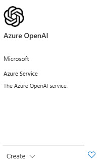
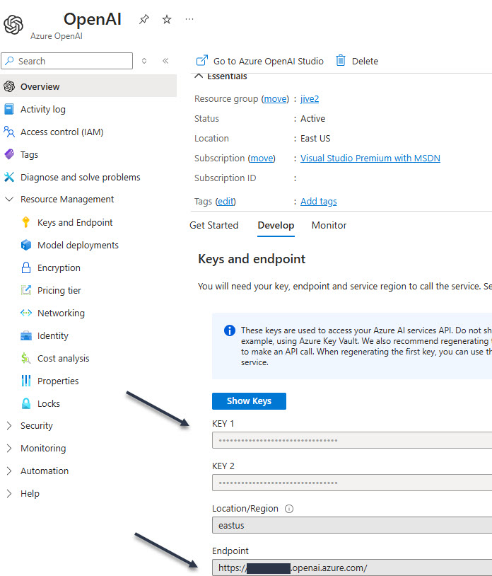

# Azure Open AI Tips
## 08/24/2024
There are tons of chat-bot articles on the web for C# projects.
Many preceded OpenAI based chat-bot. 

This project zeros in on Azure's OpenAi ChatBot solution and how it's done in August/2024 using a console application.

## Steaming

```csharp
 static async Task Main(string[] args)
        {
            Console.WriteLine("OpenAI Test");
            //await NonStreamingChat();
            await StreamingChat();
        }

```
We want to favor the streaming chat methods.  This is due to the 
desire to have answers returned as soon as possible. The effect is that it appears the chat-bot is typing the answer in over a period of time. We don't like synchronous responses because it can look like nothing is happening until the whole
answer is posted back.

## Streaming Chat Logic
As of this writing 08/25/24 this is the nuget package we imported.
```xml
<PackageReference Include="Azure.AI.OpenAI" Version="1.0.0-beta.5" />
```
Here is where it came from: [Nuget's Azure.AI.OpenAI](https://www.nuget.org/packages?q=Azure.AI.OpenAI)

## Using Statements

We must reference both Azure and Azure.AI.OpenAI. 
```csharp
using Azure.AI.OpenAI;
using Azure;
```

## 1) Creating a new OpenAIClient
```csharp
 static async Task StreamingChat()
        {
            OpenAIClient client = new OpenAIClient(
                new Uri(Uri),
                new AzureKeyCredential(APIKEY));

```
You need the APIKEY and the URI of your Azure Open AI Service. Both come from your OpenAI service in Azure. 

[OpenAI Service Overview](https://learn.microsoft.com/en-us/azure/ai-services/openai/overview)

### Create your OpenAI service in Azure

To use the APIKey and URL you must create an OpenAI Service in Azure



Once the service is  created there will be KEYs and URL values found here under the Develop tab. Both keys work but only one is required.

 

## Where do I store my keys and URL?
Don't store them in this project as somebody can easily use them. The recommendation is to use the "UserEnvironment" instead. 
## 2. Chat Completion Options

After the chat client is created, its behavior can be altered using 

```csharp

ChatCompletionsOptions options = new ChatCompletionsOptions()
 {
    Messages = { new ChatMessage(ChatRole.System, @"You are an AI assistant that helps people find information.") },
    Temperature = (float)0.7,
    MaxTokens = 800,
    NucleusSamplingFactor = (float)0.95,
    FrequencyPenalty = 0,
    PresencePenalty = 0,
 };          
```
Read about ChatCompletionOptions [here](https://learn.microsoft.com/en-us/javascript/api/@azure/openai/chatcompletions?view=azure-node-preview). 


## Interface with User

In console applications the user input is via the <code>Console.ReadLine()</code> method.

```csharp
while (true)
{
    Console.Write("Chat Prompt:");
    string line = Console.ReadLine()!;
    if (line.Equals("quit", StringComparison.OrdinalIgnoreCase))
    {
        break;
    }
    // This keeps the chat history allowing for "Smart" conversations.
    options.Messages.Add(new ChatMessage(ChatRole.User, line));

    Console.WriteLine("Response:");
    // This async Get routine is the result of the OpenAI model and engine
    Response<ChatCompletions> response =
    await client.GetChatCompletionsAsync(
        deploymentOrModelName: deployment,
        options);

    ChatCompletions completions  = response.Value;
    string fullresponse = completions.Choices[0].Message.Content;
    Console.WriteLine(fullresponse);
    options.Messages.Add(completions.Choices[0].Message);

}
```
[Chat Completions]("https://learn.microsoft.com/en-us/javascript/api/@azure/openai/chatcompletions?view=azure-node-preview")

## Trouble Shooting

Be careful on the deployment name, looks like Azure OpenAi has some trouble with certain names.
```xml
Azure.RequestFailedException: 'The API deployment for this resource does not exist. If you created the deployment within the last 5 minutes, please wait a moment and try again.
Status: 404 (Not Found)
ErrorCode: DeploymentNotFound
``` 
The key part to the error above is the "DeploymentNotFound." 
This means the deployment name is incorrect or could not be found.

Names the didn't work

- gpt-40
- gpt40

A name which did work was "ChatBot"


## Hangs and Unresponsive Behavior
If you are experiencing a hang or unresponsive behavior with the chat-bot using the "gpt-40" model, there could be several reasons for this:
1.	Model compatibility: Ensure that the "gpt-40" model is compatible with the Azure.AI.OpenAI library version you are using. It's possible that the library might not fully support or be optimized for this specific model, leading to unexpected behavior.
2.	Resource limitations: The "gpt-40" model might have certain resource requirements or limitations that are not being met. For example, if the model requires a certain amount of memory or processing power, it's possible that the system running the chatbot does not meet those requirements, leading to performance issues or hangs.
3.	API limitations: The Azure OpenAI service itself might have limitations or restrictions that could affect the performance of the chatbot. It's important to review the documentation and guidelines provided by Azure for the OpenAI service to ensure that you are using the service correctly and within its intended limits.
To troubleshoot the issue, you can try the following steps:
1.	Check for errors or exceptions: Look for any error messages or exceptions that might be thrown when running the chatbot. These can provide valuable insights into the cause of the hang.
2.	Test with a different model: Try using a different model, preferably one that is officially supported and recommended by Azure. This can help determine if the issue is specific to the "gpt-40" model or if it's a more general problem with the setup or configuration of the chatbot.
3.	Optimize code and resources: Review your code and ensure that it is optimized for performance. Consider any potential bottlenecks or areas where improvements can be made. Additionally, ensure that the system running the chatbot meets the necessary resource requirements for the model and library being used.
4.	Consult Azure support: If the issue persists, it might be helpful to reach out to Azure support for further assistance. They can provide guidance and help troubleshoot any specific issues related to the Azure OpenAI service or the Azure.AI.OpenAI library.
Remember to always refer to the official documentation and guidelines provided by Azure for the OpenAI service and the Azure.AI.OpenAI library to ensure that you are using them correctly and following best practices.